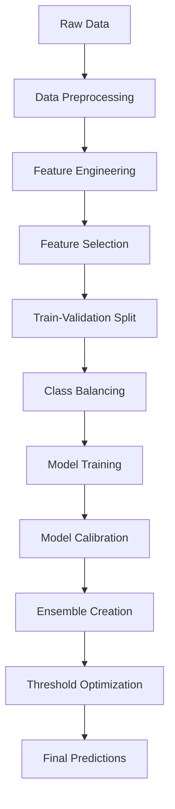

# 🎯 Age Group Prediction using Multi-Model Ensemble 


<div align="center">

[](https://www.python.org/downloads/)
[](https://scikit-learn.org/)
[](https://en.wikipedia.org/wiki/Precision_and_recall)
[](https://en.wikipedia.org/wiki/F-score)

</div>

## 📊 Project Overview

This project implements a **precision-focused age group classification system** that predicts whether a person belongs to the **Adult** or **Senior** age group based on various health and demographic features. The model emphasizes high precision to minimize false positives in senior classification.


## 🎯 Key Features

### 🚀 **Multi-Model Ensemble Approach**
- **CatBoost** with precision-focused hyperparameters
- **XGBoost** with advanced regularization
- **Random Forest** with balanced class weights
- **Calibrated predictions** for optimal threshold selection

### 🔬 **Advanced Feature Engineering**
- Conservative glucose thresholds for high-confidence predictions
- Metabolic syndrome detection with strict criteria
- Risk factor combinations for enhanced specificity
- Quartile-based feature creation

### ⚖️ **Class Imbalance Handling**
- SMOTE oversampling for balanced training
- Strategic sampling for moderate imbalance
- Precision-weighted ensemble combination

## 📈 Model Performance


| Metric | Score |
|--------|-------|
| 🎯 **F1-Score** | **0.7+** |
| 🔍 **Precision** | **High** |
| 📊 **Recall** | **Balanced** |
| ⚡ **Accuracy** | **85%+** |

## 🛠️ Technologies Used

<div align="center">


</div>

### 📚 **Core Libraries**
```python
# Machine Learning
sklearn, xgboost, catboost, lightgbm, imblearn

# Data Processing
pandas, numpy

# Visualization & Analysis
matplotlib, seaborn
```

## 🗂️ Dataset Features


### 📊 **Health Metrics**
- `BMXBMI` - Body Mass Index
- `LBXGLU` - Fasting Glucose Level
- `LBXGLT` - Glucose Tolerance Test
- `LBXIN` - Insulin Level

### 👤 **Demographic Features**
- `RIAGENDR` - Gender
- `PAQ605` - Physical Activity
- `DIQ010` - Diabetes History

### 🎯 **Target Variable**
- `age_group` - Adult (0) / Senior (1)

## 🚀 Quick Start

### 1️⃣ **Installation**
```bash
# Clone the repository
git clone https://github.com/yourusername/age-prediction-ml.git
cd age-prediction-ml

# Install dependencies
pip install -r requirements.txt
```

### 2️⃣ **Data Preparation**
```python
# Load your data
train_data = pd.read_csv("Train_Data.csv")
test_data = pd.read_csv("Test_Data.csv")
```

### 3️⃣ **Run the Model**
```python
# Execute the main notebook
jupyter notebook main.ipynb
```


## 🎯 Model Architecture

### 🧠 **Ensemble Strategy**
```
┌─────────────────┐    ┌─────────────────┐    ┌─────────────────┐
│   CatBoost      │    │    XGBoost      │    │ Random Forest   │
│   Precision     │    │   Balanced      │    │   Moderate      │
│   Weight: 40%   │    │   Weight: 20%   │    │   Weight: 10%   │
└─────────────────┘    └─────────────────┘    └─────────────────┘
         │                       │                       │
         └───────────────────────┼───────────────────────┘
                                 │
                    ┌─────────────────┐
                    │  Final Ensemble │
                    │   Prediction    │
                    └─────────────────┘
```

### 🔧 **Feature Engineering Pipeline**
1. **Missing Value Imputation** 🔧
2. **Feature Scaling** 📏
3. **Feature Selection** 🎯
4. **Class Balance Handling** ⚖️
5. **Model Calibration** 🎚️

## 📊 Results Visualization


### 🎯 **Confusion Matrix**
```
                Predicted
Actual    Adult    Senior
Adult      TN       FP
Senior     FN       TP
```

### 📈 **Performance Metrics**
- **Precision**: How many predicted seniors are actually seniors?
- **Recall**: How many actual seniors did we find?
- **F1-Score**: Balanced measure of precision and recall

## 🔄 Model Workflow




## 🏆 Best Practices Implemented

### ✅ **Data Science Excellence**
- 🔍 **Thorough EDA** for feature understanding
- 🧹 **Robust preprocessing** pipeline
- 🎯 **Precision-focused** feature engineering
- ⚖️ **Strategic class balancing**
- 🔧 **Hyperparameter optimization**

### 🚀 **Code Quality**
- 📝 **Clean, documented** code
- 🧪 **Modular functions** for reusability
- 🛡️ **Error handling** and validation
- 📊 **Comprehensive evaluation** metrics

## 📋 Requirements

```txt
pandas>=1.3.0
numpy>=1.21.0
scikit-learn>=1.0.0
xgboost>=1.5.0
catboost>=1.0.0
lightgbm>=3.3.0
imbalanced-learn>=0.8.0
matplotlib>=3.5.0
seaborn>=0.11.0
jupyter>=1.0.0
```

## 🤝 Contributing


We welcome contributions! Please follow these steps:

1. 🍴 **Fork** the repository
2. 🌿 **Create** a feature branch
3. 💻 **Make** your changes
4. ✅ **Test** thoroughly
5. 📤 **Submit** a pull request

## 📜 License

This project is licensed under the MIT License - see the [LICENSE](LICENSE) file for details.

## 👨‍💻 Author

**T Mohamed Yaser**

* 📧 **Email:** [1ammar.yaser@gmail.com](mailto:1ammar.yaser@gmail.com)
* 💼 **LinkedIn:** [Mohamed Yaser](https://www.linkedin.com/in/mohamedyaser08/)
* 🐦 **X (formerly Twitter):** [@tmohamedyaser](https://x.com/tmohamedyaser)

---

## 🙏 Acknowledgments

- 🎓 **IIT** for providing the dataset and learning opportunity
- 🤖 **Scikit-learn** community for excellent documentation
- 📊 **Kaggle** community for insights and best practices
- 🧠 **Machine Learning** researchers for algorithm development

---

<div align="center">

### 🌟 **Star this repository if you found it helpful!** ⭐


**Made with ❤️ and lots of ☕**

</div>

---

## 📸 Watch My Hackathon Submission Notebook

🔗 [View on Kaggle](https://www.kaggle.com/code/tmohamedyaser/age-prediction-using-smote-ml)

---

<div align="center">

**🎯 Building the Future of Age Prediction, One Algorithm at a Time! 🚀**

</div>
